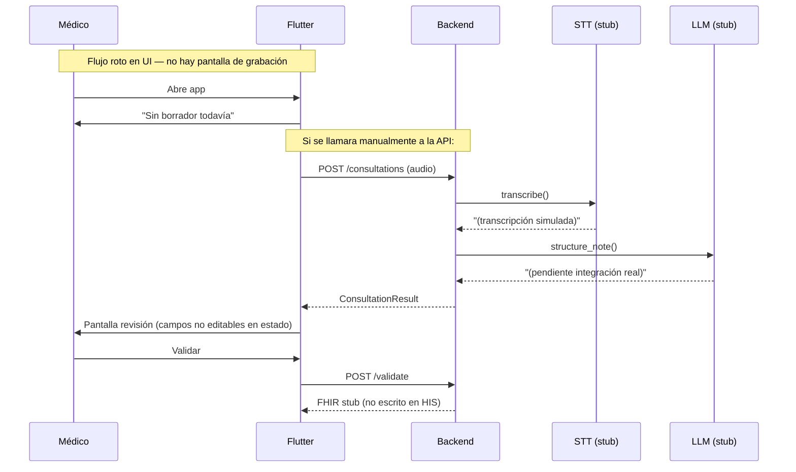

# 01 — Estado actual del proyecto

> Fecha del análisis: junio 2025  
> Versión del código: `0.1.0` (frontend), backend sin versionado explícito

## 1. Qué es el producto

**Escriba Clínico IA** automatiza la redacción administrativa de historias clínicas a partir del audio de una consulta. El médico siempre revisa y valida antes de que nada llegue al HIS. Clasificación regulatoria objetivo: **dispositivo médico Clase I** (apoyo administrativo, sin decisión clínica autónoma).

## 2. Estructura del repositorio

```
helthcare-ai-system/
├── backend/          # API FastAPI (Python 3.12)
├── frontend/         # App Flutter multiplataforma
├── CLAUDE.md         # Convenciones y reglas de cumplimiento
└── docs/             # Esta documentación
```

No existen aún: `docker-compose`, tests, CI/CD, migraciones de BD ni carpeta de infraestructura.

## 3. Backend — inventario detallado

### 3.1 Implementado y operativo

| Componente | Archivo(s) | Estado |
|------------|-----------|--------|
| Punto de entrada FastAPI | `app/main.py` | ✅ Funcional |
| Health check | `app/api/routes/health.py` | ✅ `GET /health` |
| Configuración por entorno | `app/config.py`, `.env.example` | ✅ pydantic-settings |
| Modelos Pydantic | `app/models/schemas.py` | ✅ Completos |
| Pipeline orquestador | `app/pipeline/orchestrator.py` | ✅ Flujo audio→STT→LLM |
| Interfaz STT | `app/services/stt/base.py` | ✅ Abstracta |
| Fábrica STT | `app/services/stt/__init__.py` | ✅ Por configuración |
| Interfaz LLM | `app/services/llm/base.py` | ✅ Abstracta |
| Fábrica LLM | `app/services/llm/__init__.py` | ✅ Por configuración |
| Endpoints consulta | `app/api/routes/consultations.py` | ✅ 2 endpoints |
| Dockerfile | `backend/Dockerfile` | ✅ Básico |

### 3.2 Stubs (simulados, no producción)

| Componente | Archivo | Qué falta |
|------------|---------|-----------|
| Speechmatics STT | `services/stt/speechmatics.py` | SDK/REST real, diarización, endpoint UE |
| Mistral LLM | `services/llm/mistral.py` | Cliente real, JSON schema, prompt en producción |
| Mapeo FHIR | `services/fhir/mapper.py` | `fhir.resources`, Bundle completo, escritura HIS |
| Autenticación OIDC | `core/security.py` | Validación JWT contra IdP |
| Auditoría | `core/audit.py` | Persistencia inmutable, diff borrador/validado |

### 3.3 No implementado

- Base de datos PostgreSQL (configurada en `.env` pero sin modelos SQLAlchemy ni migraciones)
- Persistencia de consultas, borradores ni estados
- Cola de trabajos para procesamiento asíncrono de audio largo
- WebSocket / streaming de transcripción en tiempo real
- Manejo de errores estructurado (reintentos, dead letter)
- Tests unitarios ni de integración
- OpenAPI con autenticación documentada
- CORS configurado para el frontend
- Rate limiting

### 3.4 Endpoints actuales

```
GET  /              → info de la app
GET  /health        → health check
POST /consultations → sube audio, devuelve borrador (requiere token OAuth2)
POST /consultations/{id}/validate → valida nota y genera FHIR (stub)
```

**Problema de auth en desarrollo:** `get_current_user` acepta cualquier token no vacío y devuelve `demo-practitioner`. Sin token válido en el header `Authorization: Bearer ...`, FastAPI devuelve 401.

### 3.5 Dependencias

`requirements.txt` incluye solo el núcleo FastAPI. Las integraciones están comentadas:

```
# fhir.resources, mistralai, speechmatics-python
# sqlalchemy[asyncio], asyncpg, celery[redis]
```

## 4. Frontend — inventario detallado

### 4.1 Implementado

| Componente | Archivo | Estado |
|------------|---------|--------|
| App shell | `lib/main.dart` | ✅ Material 3, Riverpod |
| Cliente HTTP | `lib/core/api_client.dart` | ✅ Upload + validate |
| Configuración | `lib/core/config.dart` | ✅ `API_BASE_URL` por dart-define |
| Modelo nota clínica | `lib/models/clinical_note.dart` | ✅ Espejo del backend |
| Controlador consulta | `consultation_controller.dart` | ✅ Estados + lógica API |
| Pantalla revisión | `review_screen.dart` | ⚠️ Parcial |
| Grabador audio | `audio_recorder.dart` | ⚠️ Clase aislada, sin UI |

### 4.2 Dependencias declaradas pero no usadas

- `go_router` — no hay rutas ni navegación
- `web_socket_channel` — no hay streaming
- `flutter_secure_storage` — no hay auth ni tokens
- `intl` — no hay i18n configurada

### 4.3 Gaps críticos de UI

1. **`main.dart` abre directamente `ReviewScreen`** sin borrador → pantalla vacía ("Sin borrador todavía")
2. **No hay pantalla de grabación** ni flujo de consentimiento del paciente
3. **`ConsultationRecorder` no está conectado** al controlador ni a ningún widget
4. **Los `TextFormField` de revisión no actualizan el estado** — las ediciones del médico se pierden al validar
5. **No se muestran flags `needs_confirmation`** del LLM
6. **No hay indicador de transparencia IA** (nota generada con IA)
7. **Sin manejo de errores** en UI (estado `error` del controlador no se renderiza)
8. **Sin autenticación** — las llamadas API fallarán con 401 en backend real
9. **Arquitectura plana** — no sigue feature-first con capas domain/data/presentation ni `freezed`

### 4.4 Tests

No existen tests en `frontend/test/` ni `flutter_test` configurado con casos.

## 5. Flujo de extremo a extremo hoy



## 6. Lo que SÍ está bien planteado

- **Abstracción de proveedores** (`STTProvider`, `LLMProvider`) — permite cambiar Speechmatics/Mistral sin tocar el pipeline
- **Modelo de datos alineado con FHIR** — secciones estándar de historia clínica
- **Minimización de audio** en el orquestador (`del audio_bytes` tras STT)
- **Prompt anti-alucinación** definido en `mistral.py` (aunque no se usa aún)
- **Separación rutas / pipeline / servicios** en backend
- **Reglas de cumplimiento** documentadas en `CLAUDE.md`

## 7. Riesgos del estado actual

| Riesgo | Impacto | Mitigación |
|--------|---------|------------|
| Stubs en producción | Datos clínicos ficticios | No desplegar sin integraciones reales |
| Sin auth real | Acceso no controlado | OIDC antes de piloto |
| Sin persistencia | Pérdida de consultas | PostgreSQL + estados |
| UI incompleta | Producto inusable | Priorizar flujo grabación→revisión |
| Sin tests | Regresiones silenciosas | Tests del pipeline como mínimo |
| Sin auditoría persistente | Incumplimiento RGPD/MDR | Tabla de auditoría append-only |

## 8. Comandos verificados

```bash
# Backend
cd backend && uvicorn app.main:app --reload

# Frontend
cd frontend && flutter run --dart-define=API_BASE_URL=http://localhost:8000
```

La documentación interactiva de la API está en `http://localhost:8000/docs` una vez levantado el backend.
