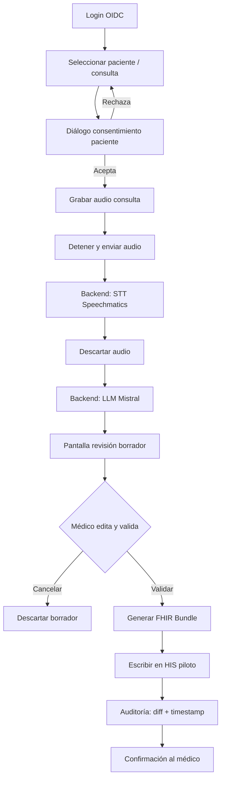

# 02 — Visión del MVP

## 1. Definición de MVP

El **MVP (Minimum Viable Product)** de Escriba Clínico IA es la versión mínima que permite a **un médico del hospital piloto** completar el ciclo completo de una consulta real con datos de pacientes, cumpliendo las reglas de cumplimiento del producto.

### Objetivo del MVP

> Un médico graba una consulta con consentimiento del paciente, recibe un borrador estructurado de historia clínica generado por IA, lo revisa y edita, y al validar la nota queda registrada en el HIS del hospital piloto vía FHIR — todo procesado dentro de la UE.

### Lo que el MVP **sí** incluye

| Capacidad | Descripción |
|-----------|-------------|
| Captura de audio | Grabación en la app Flutter con diálogo de consentimiento |
| Transcripción | Speechmatics (español, vocabulario médico, diarización médico/paciente) |
| Estructuración | Mistral con salida JSON → secciones de historia clínica |
| Revisión humana | Pantalla editable con marcado de campos dudosos |
| Validación | El médico confirma explícitamente antes de guardar |
| Integración HIS | Escritura FHIR R4 al sistema del hospital piloto |
| Autenticación | OIDC (médico identificado, rol verificado) |
| Auditoría | Registro inmutable de acciones y diff borrador vs. validado |
| Transparencia IA | Indicador visible de que la nota fue asistida por IA |
| Residencia UE | Backend y proveedores en jurisdicción europea |

### Lo que el MVP **no** incluye (post-MVP)

| Fuera de alcance MVP | Motivo |
|---------------------|--------|
| Transcripción en tiempo real (streaming) | Complejidad; batch es suficiente para piloto |
| Múltiples especialidades con prompts distintos | Una especialidad piloto (p. ej. medicina general) |
| Multi-tenant / varios hospitales | Un hospital piloto |
| App stores (iOS/Android publicadas) | Distribución interna o sideload para piloto |
| Análisis de calidad del borrador por IA | Riesgo regulatorio (decisión clínica) |
| Conservación de audio | Minimización RGPD; solo transcripción |
| Panel de administración | Gestión manual inicial |
| Certificación MDR formal | Clase I puede comercializarse con declaración de conformidad; certificación notificada no requerida para Clase I |
| Soporte offline completo | Requiere conectividad al backend UE |

## 2. Usuario objetivo del MVP

**Médico de atención primaria o especialidad acordada** en el hospital piloto, que:

- Ya usa el HIS del hospital para documentar consultas
- Acepta revisar y editar borradores antes de guardar
- Tiene credenciales OIDC del hospital

**Paciente:** da consentimiento explícito antes de la grabación (UI + registro en auditoría).

## 3. Flujo objetivo del MVP

## 4. Criterios de aceptación del MVP

### Funcionales

- [ ] El médico puede autenticarse con las credenciales del hospital
- [ ] Se registra el consentimiento del paciente antes de grabar
- [ ] Una consulta de 5–15 minutos se transcribe con diarización usable
- [ ] El borrador contiene las 5 secciones: motivo, anamnesis, exploración, diagnóstico, plan
- [ ] Los campos dudosos aparecen marcados para confirmación
- [ ] El médico puede editar cualquier sección antes de validar
- [ ] La nota validada aparece en el HIS del hospital piloto
- [ ] El audio no se almacena tras la transcripción
- [ ] La nota indica que fue generada con asistencia de IA

### No funcionales

- [ ] Tiempo de procesamiento < 3 minutos para consulta de 10 minutos (objetivo)
- [ ] Disponibilidad backend ≥ 99 % en horario clínico piloto
- [ ] Todos los datos de salud procesados en región UE
- [ ] Logs sin datos clínicos en texto plano
- [ ] Auditoría consultable (quién, qué, cuándo)

### Cumplimiento

- [ ] DPIA o evaluación de impacto documentada
- [ ] DPA firmado con Speechmatics y Mistral
- [ ] Clasificación MDR Clase I documentada
- [ ] Información al paciente sobre uso de IA en documentación

## 5. Stack objetivo (sin cambios respecto al diseño actual)

| Capa | Tecnología |
|------|------------|
| Cliente | Flutter 3.x, Riverpod, Dio |
| API | FastAPI, Pydantic v2, async |
| STT | Speechmatics (UE) |
| LLM | Mistral (UE) |
| BD | PostgreSQL (UE) |
| Auth | OIDC (Keycloak u IdP del hospital) |
| Integración | HL7 FHIR R4 |
| Infra | Docker, cloud UE (OVHcloud / Scaleway) |

## 6. Entregables del MVP

1. **App Flutter** — flujo completo grabación → revisión → validación
2. **API backend** — integraciones reales, persistencia, auditoría
3. **Conector FHIR** — adaptado al HIS del hospital piloto
4. **Despliegue** — entorno de staging + producción piloto en UE
5. **Documentación** — manual de usuario médico, runbook operativo, DPIA
6. **Tests** — pipeline, API, flujo crítico Flutter

## 7. Métricas de éxito del piloto

| Métrica | Objetivo piloto |
|---------|-----------------|
| Consultas documentadas con la herramienta | ≥ 50 en 4 semanas |
| Tasa de validación sin edición mayor | Medir baseline (no es KPI de calidad clínica) |
| Tiempo medio médico en revisión | < 5 minutos |
| Errores de integración FHIR | < 5 % |
| Incidentes de seguridad / fuga de datos | 0 |
| Satisfacción médico (encuesta simple) | ≥ 3.5/5 |

## 8. Hipótesis a validar con el MVP

1. La calidad del borrador de Speechmatics + Mistral es suficiente para reducir tiempo de documentación
2. Los médicos confían en revisar y editar en lugar de reescribir desde cero
3. La integración FHIR con el HIS piloto es viable sin customización masiva
4. El flujo de consentimiento no interrumpe excesivamente la consulta
5. La postura de cumplimiento Clase I es aceptable para el comité de ética del hospital
