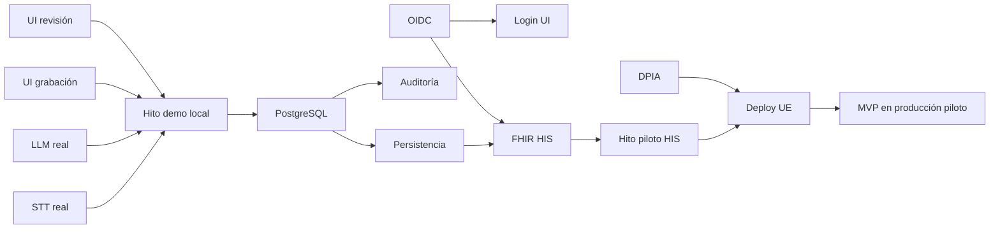

# 03 — Brechas y roadmap hacia el MVP

## 1. Matriz de brechas

Leyenda: 🔴 Crítico para MVP | 🟡 Importante | 🟢 Deseable post-MVP

### Backend

| # | Brecha | Prioridad | Esfuerzo | Dependencias |
|---|--------|-----------|----------|--------------|
| B1 | Integración real Speechmatics (batch + diarización) | 🔴 | M | Cuenta + DPA UE |
| B2 | Integración real Mistral (JSON schema + prompt) | 🔴 | M | Cuenta + DPA UE |
| B3 | Autenticación OIDC (validación JWT) | 🔴 | M | IdP hospital |
| B4 | PostgreSQL: modelos, migraciones, repos | 🔴 | M | — |
| B5 | Persistencia de consultas y estados | 🔴 | M | B4 |
| B6 | Conector FHIR → HIS piloto | 🔴 | L | Especificación HIS |
| B7 | Auditoría persistente + diff borrador/validado | 🔴 | M | B4 |
| B8 | CORS + manejo errores HTTP | 🟡 | S | — |
| B9 | Tests pipeline y API | 🟡 | M | B1, B2 |
| B10 | Procesamiento async (audio largo) | 🟡 | M | B4, cola |
| B11 | Streaming STT WebSocket | 🟢 | L | B1 |
| B12 | Rate limiting / throttling | 🟢 | S | B3 |

### Frontend

| # | Brecha | Prioridad | Esfuerzo | Dependencias |
|---|--------|-----------|----------|--------------|
| F1 | Pantalla login OIDC | 🔴 | M | B3 |
| F2 | Pantalla grabación + consentimiento | 🔴 | M | — |
| F3 | Conectar `ConsultationRecorder` al flujo | 🔴 | S | F2 |
| F4 | Navegación completa (go_router) | 🔴 | S | F1, F2 |
| F5 | Revisión editable (binding estado) | 🔴 | S | — |
| F6 | UI campos `needs_confirmation` | 🔴 | S | B2 |
| F7 | Badge transparencia IA | 🔴 | XS | — |
| F8 | Estados loading / error / éxito | 🟡 | S | — |
| F9 | Selección paciente (o ID desde HIS) | 🟡 | M | B6 |
| F10 | Secure storage para tokens | 🟡 | S | F1 |
| F11 | Refactor Clean Architecture + freezed | 🟢 | L | — |
| F12 | Tests widget / integración | 🟡 | M | F1–F8 |

### Infraestructura y operaciones

| # | Brecha | Prioridad | Esfuerzo | Dependencias |
|---|--------|-----------|----------|--------------|
| I1 | docker-compose (API + PostgreSQL) | 🔴 | S | B4 |
| I2 | Despliegue cloud UE (staging) | 🔴 | M | I1 |
| I3 | CI/CD (lint, test, build) | 🟡 | M | B9, F12 |
| I4 | Secretos / gestión env producción | 🔴 | S | I2 |
| I5 | Monitorización y alertas | 🟡 | M | I2 |
| I6 | Backups BD cifrados | 🔴 | S | B4, I2 |

### Cumplimiento y documentación

| # | Brecha | Prioridad | Esfuerzo | Dependencias |
|---|--------|-----------|----------|--------------|
| C1 | DPIA / EIPD | 🔴 | M | — |
| C2 | DPA con proveedores STT/LLM | 🔴 | S | Contratos |
| C3 | Política de privacidad + consentimiento | 🔴 | M | F2 |
| C4 | Declaración conformidad MDR Clase I | 🟡 | L | C1 |
| C5 | Manual usuario médico | 🟡 | S | MVP funcional |

**Esfuerzo:** XS = horas, S = 1–3 días, M = 1–2 semanas, L = 2–4 semanas

---

## 2. Roadmap por fases

### Fase 0 — Fundamentos (semana 1–2)

**Objetivo:** Flujo demo real de extremo a extremo en local, sin HIS.

| Tarea | IDs | Responsable sugerido |
|-------|-----|---------------------|
| Implementar Speechmatics batch | B1 | Backend |
| Implementar Mistral structured output | B2 | Backend |
| Pantalla grabación + consentimiento | F2, F3 | Frontend |
| Navegación y binding revisión | F4, F5, F6, F7 | Frontend |
| CORS en FastAPI | B8 | Backend |
| Auth dev bypass documentado (solo local) | — | Backend |
| docker-compose local | I1 | DevOps |

**Hito:** Médico de desarrollo graba audio real → ve borrador real → edita → valida (FHIR en respuesta JSON).

---

### Fase 1 — Seguridad y persistencia (semana 3–4)

**Objetivo:** Sistema con identidad real y trazabilidad.

| Tarea | IDs |
|-------|-----|
| OIDC en backend | B3 |
| Login en Flutter + secure storage | F1, F10 |
| Modelos BD + migraciones Alembic | B4, B5 |
| Auditoría persistente con diff | B7 |
| Tests pipeline | B9 |
| Eliminar bypass auth en staging/prod | B3 |

**Hito:** Consulta persistida en BD con historial de auditoría; solo usuarios autenticados acceden.

---

### Fase 2 — Integración HIS (semana 5–7)

**Objetivo:** Nota validada en el HIS del hospital piloto.

| Tarea | IDs |
|-------|-----|
| Especificar mapping FHIR con equipo HIS | B6 |
| Implementar conector (REST FHIR del hospital) | B6 |
| Mapeo `fhir.resources` tipado | B6 |
| Selección paciente en UI | F9 |
| Pruebas integración con sandbox HIS | B6 |

**Hito:** Primera nota de consulta real visible en el HIS piloto.

---

### Fase 3 — Piloto clínico (semana 8–12)

**Objetivo:** Despliegue controlado con médicos reales.

| Tarea | IDs |
|-------|-----|
| Despliegue producción UE | I2, I4, I6 |
| DPIA y consentimiento formal | C1, C3 |
| DPA proveedores | C2 |
| Monitorización | I5 |
| Manual usuario | C5 |
| CI/CD | I3 |
| Ajuste prompts según feedback médico | B2 |
| Procesamiento async si latencia es problema | B10 |

**Hito:** ≥ 50 consultas piloto completadas con métricas recogidas.

---

## 3. Orden de dependencias (diagrama)



---

## 4. Estimación global

| Fase | Duración | Personas (aprox.) |
|------|----------|-----------------|
| Fase 0 | 2 semanas | 1 backend + 1 frontend |
| Fase 1 | 2 semanas | 1 backend + 1 frontend |
| Fase 2 | 3 semanas | 1 backend + contacto HIS |
| Fase 3 | 4 semanas | equipo completo |
| **Total** | **~11 semanas** | 2–3 FTE |

*Estimación orientativa; la integración HIS (Fase 2) es la mayor incógnita.*

---

## 5. Quick wins (esta semana)

Tareas de alto impacto y bajo esfuerzo para avanzar rápido:

1. **F5** — Hacer editables los campos de `ReviewScreen` (controllers + estado)
2. **F4** — Añadir `HomeScreen` con botón grabar y rutas básicas
3. **F2** — Diálogo de consentimiento antes de grabar
4. **F3** — Conectar `ConsultationRecorder` → `submitAudio`
5. **B8** — Configurar CORS en `main.py` para desarrollo Flutter
6. **B8** — Endpoint auth dev opcional (`ENV=dev` sin token) solo local
7. **I1** — `docker-compose.yml` con PostgreSQL

---

## 6. Decisiones pendientes del equipo

| Decisión | Opciones | Impacto |
|----------|----------|---------|
| Hospital piloto y HIS concreto | — | Define conector FHIR |
| IdP OIDC | Keycloak propio vs. IdP hospital | Fase 1 |
| Especialidad piloto | Medicina general vs. otra | Prompt LLM |
| Distribución app | Web vs. desktop vs. móvil sideload | Frontend build |
| Cloud UE | OVHcloud vs. Scaleway | Infra |
| ¿Procesamiento sync o async? | Sync MVP si consultas < 15 min | Arquitectura |

---

## 7. Checklist MVP (resumen)

```
Backend
  [ ] Speechmatics real
  [ ] Mistral real
  [ ] OIDC
  [ ] PostgreSQL + consultas
  [ ] Auditoría + diff
  [ ] FHIR → HIS piloto

Frontend
  [ ] Login
  [ ] Consentimiento + grabación
  [ ] Revisión editable
  [ ] Validación
  [ ] Errores y loading

Infra
  [ ] docker-compose
  [ ] Deploy UE staging/prod
  [ ] Backups

Cumplimiento
  [ ] DPIA
  [ ] DPA proveedores
  [ ] Consentimiento paciente
```
